# Semi-adaptive Synergetic Two-way Pseudoinverse Learning System (SSTPLS)

<p align="center">
  
</p>

<p align="center">
  <strong>School of Artificial Intelligence — Amrita Vishwa Vidyapeetham</strong><br/>
  <em>A Non-Gradient Deep Learning Approach</em><br/><br/>
  <strong>Team C5</strong>&nbsp;&nbsp;|&nbsp;&nbsp;
  Sai Reddy (CB.SC.U4AIE24205) &nbsp;|&nbsp;
  Devana (CB.SC.U4AIE24213) &nbsp;|&nbsp;
  Manas (CB.SC.U4AIE24257) &nbsp;|&nbsp;
  Zahwa (CB.SC.U4AIE24261)
</p>

---

## Table of Contents

1. [Project Title — Word-by-Word Explanation](#1-project-title--word-by-word-explanation)
2. [Problem Statement](#2-problem-statement)
3. [Why Pseudoinverse Learning?](#3-why-pseudoinverse-learning)
4. [Methodology Overview](#4-methodology-overview)
5. [System Architecture — Full Picture](#5-system-architecture--full-picture)
6. [PILAE — Pseudoinverse Learning Based Autoencoder](#6-pilae--pseudoinverse-learning-based-autoencoder)
7. [Mathematical Derivation of the PILAE Solution](#7-mathematical-derivation-of-the-pilae-solution)
8. [FISTA — Fast Iterative Shrinkage-Thresholding Algorithm](#8-fista--fast-iterative-shrinkage-thresholding-algorithm)
9. [Proximal Operator](#9-proximal-operator)
10. [ADMM — Alternating Direction Method of Multipliers](#10-admm--alternating-direction-method-of-multipliers)
11. [Backward Learning](#11-backward-learning)
12. [Feature Fusion](#12-feature-fusion)
13. [Toy Example — Step-by-Step Walkthrough](#13-toy-example--step-by-step-walkthrough)
14. [Datasets](#14-datasets)
15. [Results — Synthetic 0/1 Dataset](#15-results--synthetic-01-dataset)
16. [Results — MNIST Dataset](#16-results--mnist-dataset)
17. [Results — F-MNIST Dataset](#17-results--f-mnist-dataset)
18. [Results — NORB Dataset](#18-results--norb-dataset)
19. [FISTA vs ADMM Comparison](#19-fista-vs-admm-comparison)
20. [Conclusion and Contributions](#20-conclusion-and-contributions)
21. [Glossary](#21-glossary)
22. [Citation](#22-citation)

---

## 1. Project Title — Word-by-Word Explanation

**Semi-adaptive Synergetic Two-way Pseudoinverse Learning System** — each word is precise:

| Word | Meaning |
|---|---|
| **Semi-adaptive** | Network grows its own depth automatically via early stopping — neuron widths are still pre-set |
| **Synergetic** | Multiple subsystems train in parallel on random subsets and combine their predictions |
| **Two-way** | Learns from data (forward) AND from labels (backward) simultaneously |
| **Pseudoinverse** | Weights solved analytically in one step — no gradient descent, no iterations |
| **Learning System** | End-to-end pipeline from raw input to final class prediction |

---

### Semi-adaptive — How Depth is Decided
```
Start with 1 hidden layer
         │
         ▼
    Train the layer
         │
         ▼
  Check validation accuracy
         │
   ┌─────┴──────┐
  YES           NO
   │             │
   ▼             ▼
Add another   STOP HERE
  layer       (Early Stopping)
   │
   └──────► (loop back to train)
```


The model decides its own depth — no human picks the number of layers.

---

### Synergetic — Ensemble of Subsystems

Each subsystem sees a **different random 80%** of the data and therefore learns slightly different features. Their output score matrices are **summed element-wise** to produce a more robust final answer.

---

### Two-way — Forward and Backward

| Direction | Input | What it extracts |
|---|---|---|
| **Forward** | Raw data $X$ | Structural patterns, edges, textures |
| **Backward** | Class labels $Y$ | Class-discriminative features |

Both feature sets are fused before the classifier — richer than either alone.

---

### Pseudoinverse — One-Step Closed-Form Solution

Instead of iterating thousands of times with gradient descent, every weight matrix is solved **once** using:

$$W_d = X H^{\top} (H H^{\top} + \lambda I)^{-1}$$

No learning rate. No backpropagation. No vanishing gradients. One matrix inversion gives the exact optimal weights.

---

## 2. Problem Statement

### Limitations of Standard Gradient Descent

| Problem | Description |
|---|---|
| **Slow training** | Data passes through the network thousands of times before convergence |
| **Hyperparameter sensitivity** | Wrong learning rate or batch size → model fails or diverges |
| **Vanishing gradients** | Error signal weakens layer by layer → early layers learn almost nothing |
| **Exploding gradients** | Error signal grows out of control → weights become NaN |
| **Manual depth selection** | Number of layers chosen by trial and error — no principled method |

> **SSTPLS addresses every one of these** by replacing gradient descent with one-step pseudoinverse solutions and replacing manual architecture design with adaptive early stopping.

---

## 3. Why Pseudoinverse Learning?

| Gradient Descent Problem | Pseudoinverse Solution |
|---|---|
| Thousands of slow iterations | One closed-form step: $$W_d = XH^{\top}(HH^{\top} + \lambda I)^{-1}$$ |
| Sensitive to learning rate | No learning rate — only $\lambda$ (stable, interpretable) |
| Vanishing / exploding gradients | No gradient — weights computed directly from data |
| Manual depth tuning | Early stopping adds layers until accuracy plateaus |

---

## 4. Methodology Overview

<p align="center">
  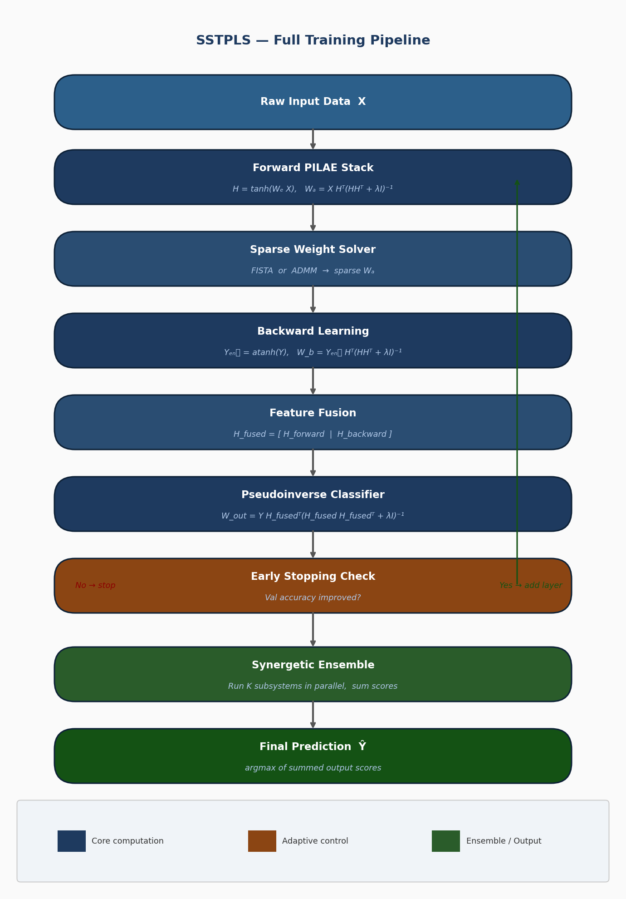
</p>

The four main stages:

1. **Forward PILAE Stack** — stacked pseudoinverse autoencoders extract structural features layer by layer
2. **Sparse Weight Solver** — FISTA or ADMM regularises decoder weights for sparsity
3. **Backward Learning** — labels are injected backwards to extract class-discriminative features
4. **Feature Fusion + Classifier** — forward and backward features are concatenated, then a final pseudoinverse classifier is trained

---

## 5. System Architecture — Full Picture

### Synergetic Ensemble

<p align="center">
  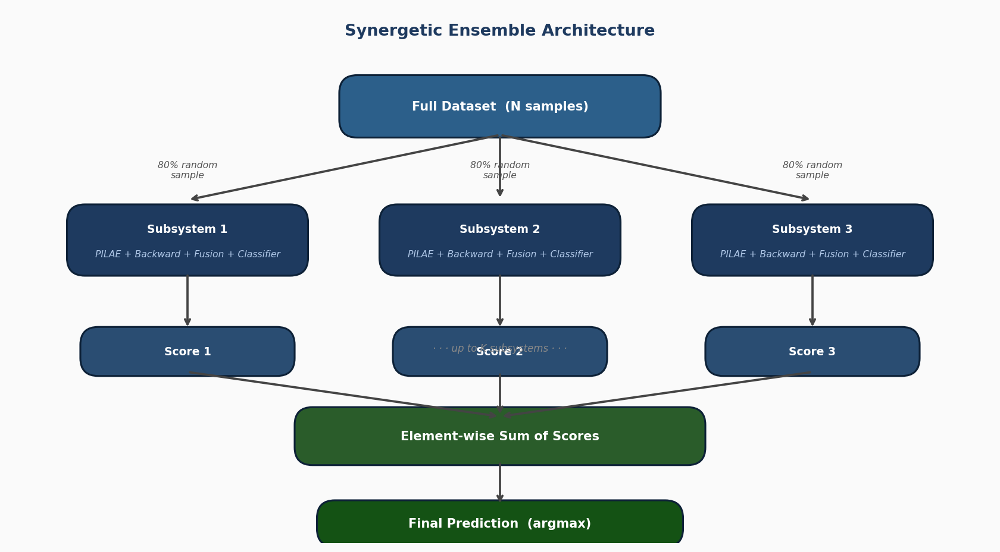
</p>

Each subsystem is a complete SSTPLS model. $K$ subsystems run in parallel on different random 80% samples. Their output score matrices are summed:

$$\hat{Y}_{\text{ensemble}} = \sum_{k=1}^{K} \hat{Y}_k$$

Final predicted class per sample: $\arg\max$ over the rows of $\hat{Y}_{\text{ensemble}}$.

---

### Two-Way Learning (Forward + Backward)

<p align="center">
  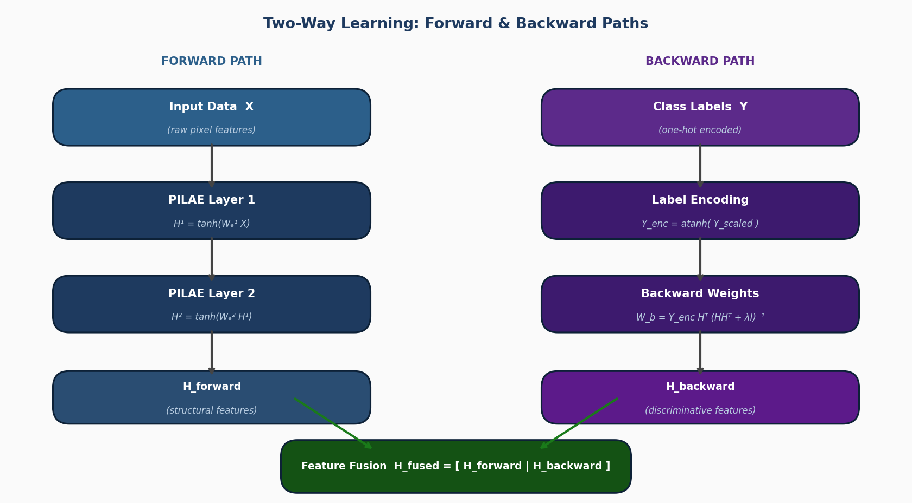
</p>

The forward path extracts what the data **looks like**. The backward path extracts what makes each class **different**. Fusing both gives the classifier the richest possible information.

---

## 6. PILAE — Pseudoinverse Learning Based Autoencoder

<p align="center">
  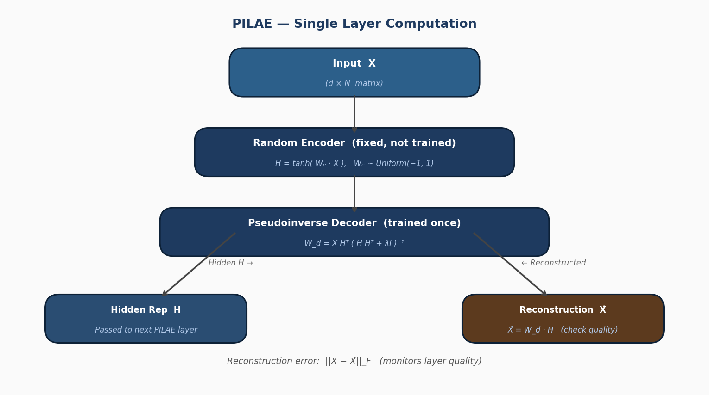
</p>

**Key insight:** only the decoder needs to be trained. The encoder is **random and frozen** — this is what makes PILAE so fast.

### Step-by-Step

**Step 1 — Random Encoder (never updated):**

$$H = \tanh(W_e X)$$

$W_e$ is sampled once from a uniform distribution and frozen. $H \in \mathbb{R}^{n_h \times N}$ where $n_h$ = hidden neurons, $N$ = samples.

**Step 2 — Pseudoinverse Decoder (trained in one step):**

$$W_d = X H^{\top} (H H^{\top} + \lambda I)^{-1}$$

**Step 3 — Reconstruction (quality check):**

$$\hat{X} = W_d H, \qquad \text{error} = \|X - \hat{X}\|_F$$

The hidden representation $H$ is passed as input to the next PILAE layer.

---

## 7. Mathematical Derivation of the PILAE Solution

### Objective Function

We want the decoder $W_d$ that minimises reconstruction error with Tikhonov (ridge) regularisation:

$$\min_{W_d} \|X - W_d H\|_F^2 + \lambda \|W_d\|_F^2$$

### Closed-Form Derivation

Take the matrix derivative and set to zero:

$$\frac{\partial \mathcal{L}}{\partial W_d} = -2(X - W_d H)H^{\top} + 2\lambda W_d = 0$$

Rearrange:

$$X H^{\top} = W_d (H H^{\top} + \lambda I)$$

Solve:

$$W_d = X H^{\top} (H H^{\top} + \lambda I)^{-1}$$

For any $\lambda > 0$, the matrix $(H H^{\top} + \lambda I)$ is symmetric positive definite — always invertible, always a unique solution.

### Matrix Dimensions

| Symbol | Dimension | Meaning |
|---|---|---|
| $X$ | $d \times N$ | Input data ($d$ features, $N$ samples) |
| $W_e$ | $n_h \times d$ | Random encoder weights |
| $H$ | $n_h \times N$ | Hidden representation |
| $H H^{\top}$ | $n_h \times n_h$ | Gram matrix of hidden layer |
| $\lambda I$ | $n_h \times n_h$ | Regularisation (identity scaled by $\lambda$) |
| $W_d$ | $d \times n_h$ | Decoder weights — what we solve for |

### Numerical Example

$$X = \begin{pmatrix} 0.5 & 0.8 \\ 0.3 & 0.9 \end{pmatrix}, \qquad W_e = \begin{pmatrix} 0.2 & -0.4 \\ 0.7 & 0.1 \\ -0.3 & 0.5 \end{pmatrix}$$

Compute hidden representation:

$$H = \tanh\left( \begin{pmatrix} 0.2 & -0.4 \\ 0.7 & 0.1 \\ -0.3 & 0.5 \end{pmatrix} \begin{pmatrix} 0.5 & 0.8 \\ 0.3 & 0.9 \end{pmatrix} \right) = \tanh\begin{pmatrix} -0.02 & -0.28 \\ 0.38 & 0.65 \\ 0.00 & 0.21 \end{pmatrix}$$

Then $$W_d = X H^{\top} (H H^{\top} + 0.01 I)^{-1}$$ gives the optimal decoder in a **single matrix operation**.

---

## 8. FISTA — Fast Iterative Shrinkage-Thresholding Algorithm

### What is FISTA?

FISTA (Fast Iterative Shrinkage-Thresholding Algorithm) is an accelerated version of the Iterative Shrinkage-Thresholding Algorithm (ISTA). It is used to solve the sparse weight optimisation problem when we want the decoder weights $W_d$ to be sparse (many exact zeros) using $\ell_1$ regularisation (LASSO). 

FISTA is much faster than standard gradient descent or plain ISTA because it uses **Nesterov momentum** (a look-ahead acceleration technique). This gives it a convergence rate of $\mathcal{O}(1/k^2)$ instead of $\mathcal{O}(1/k)$.

**Why we use FISTA in SSTPLS:**  
The plain pseudoinverse solution gives dense weights. FISTA solves the non-smooth $\ell_1$ problem efficiently, producing sparse, interpretable weights while keeping the training non-gradient and very fast.

### Objective

$$\min_{W_d} \|X - W_d H\|_F^2 + \lambda \|W_d\|_1$$

### Algorithm (Full Steps)

**Initialise:** $W^{(0)} = \mathbf{0}$, $Z^{(1)} = W^{(0)}$, $t_1 = 1$

**Repeat for** $k = 1, 2, \ldots, K$:

**Step 1 — Gradient step** on smooth part:

$$G^{(k)} = Z^{(k)} - \frac{1}{L} \nabla f(Z^{(k)}), \qquad \nabla f(W_d) = 2(W_d H - X) H^{\top}$$

$L = 2 \lambda_{\max}(H H^{\top})$ (Lipschitz constant).

**Step 2 — Proximal step** (soft-thresholding):

$$W^{(k)} = \mathcal{S}_{\lambda/L}(G^{(k)})$$

**Step 3 — Nesterov momentum:**

$$t_{k+1} = \frac{1 + \sqrt{1 + 4 t_k^2}}{2}, \qquad Z^{(k+1)} = W^{(k)} + \frac{t_k - 1}{t_{k+1}} (W^{(k)} - W^{(k-1)})$$

---
## 9. Proximal Operator

The **soft-thresholding** function, applied element-wise with threshold $\tau = \lambda/L$:

$$[\mathcal{S}_{\tau}(W)]_{ij} = \mathrm{sign}(w_{ij}) \cdot \max(|w_{ij}| - \tau, 0)$$

**Effect:** weights with $|w_{ij}| \leq \tau$ become **exactly zero** — this is where sparsity comes from.

More explicitly, for each scalar weight $w$:

$$\mathcal{S}_{\tau}(w) = \begin{cases}
w - \tau & \text{if } w > \tau \\
0 & \text{if } |w| \leq \tau \\
w + \tau & \text{if } w < -\tau
\end{cases}$$

The full proximal operator solves:

$$\mathcal{S}_{\tau}(V) = \arg\min_{W} \{ \|W\|_1 + \frac{1}{2\tau}\|W - V\|_F^2 \}$$

where $\tau = \lambda / L$ and $L = 2 \lambda_{\max}(HH^{\top})$ is the Lipschitz constant of $\nabla f$.

### Worked Example

$$\tau = 0.3, \qquad W = \begin{pmatrix} 0.8 & -0.1 & 0.5 \\ -0.6 & 0.2 & -0.4 \end{pmatrix}$$

$$\mathcal{S}_{0.3}(W) = \begin{pmatrix} 0.5 & 0 & 0.2 \\ -0.3 & 0 & -0.1 \end{pmatrix}$$

Entries $-0.1$ and $0.2$ fall within the threshold $|\cdot| \leq 0.3$ and are zeroed out exactly.

## 10. ADMM — Alternating Direction Method of Multipliers

### What is ADMM?

ADMM (Alternating Direction Method of Multipliers) is another powerful algorithm to solve the same sparse optimisation problem as FISTA, but it splits the problem into two easier sub-problems and solves them alternately until they agree. 

It is very good at enforcing exact constraints and usually achieves **lower reconstruction residual** than FISTA. ADMM is especially useful when high accuracy in the sparse solution is needed.

**Why we use ADMM in SSTPLS:**  
It provides an alternative sparse solver to FISTA. We compare both in the results section — ADMM gives lower residual, while FISTA is often faster on small/sparse data.

### Idea

ADMM splits the problem by introducing auxiliary variable $Z$:

$$\min_{W_d,\, Z} \|X - W_d H\|_F^2 + \lambda \|Z\|_1 \quad \text{subject to} \quad W_d = Z$$

### Augmented Lagrangian (with dual variable $U$)

$$\mathcal{L}_{\rho}(W_d, Z, U) = \|X - W_d H\|_F^2 + \lambda \|Z\|_1 + \frac{\rho}{2}\|W_d - Z + U\|_F^2$$

### Three-Step Update Loop

**Initialise:** $W_d^{(0)} = Z^{(0)} = U^{(0)} = \mathbf{0}$

**W-update** — closed-form ridge regression:

$$W_d^{(k+1)} = (X H^{\top} + \rho (Z^{(k)} - U^{(k)})) (H H^{\top} + \rho I)^{-1}$$

**Z-update** — soft-thresholding:

$$Z^{(k+1)} = \mathcal{S}_{\lambda/\rho}(W_d^{(k+1)} + U^{(k)})$$

**U-update** — tracks constraint violation $W_d - Z$:

$$U^{(k+1)} = U^{(k)} + W_d^{(k+1)} - Z^{(k+1)}$$

### FISTA vs ADMM

| Property | FISTA | ADMM |
|---|---|---|
| W-update | Gradient step | Exact ridge regression |
| Convergence rate | $\mathcal{O}(1/k^2)$ | Linear (primal + dual residuals) |
| Final residual | Higher (approximate) | Lower (exact constraint) |
| Speed | Faster per iteration | Slower but more accurate |

---

## 11. Backward Learning

### Why Backward?

Forward PILAE learns features that **reconstruct** the input. But for classification we need features that **distinguish classes**. Backward learning injects label information directly into the feature space.

### How It Works

**Step 1 — Scale labels to avoid infinity:**

$$Y_{\text{scaled}} = 0.9 Y + 0.05 \quad \Rightarrow \quad \text{values in } [0.05, 0.95]$$

**Step 2 — Encode with inverse tanh:**

$$Y_{\text{enc}} = \tanh^{-1}(Y_{\text{scaled}})$$

When the network later applies $\tanh$, it recovers values close to the original labels.

**Step 3 — Backward weights (same pseudoinverse formula):**

$$W_b = Y_{\text{enc}} H^{\top} (H H^{\top} + \lambda I)^{-1}$$

**Step 4 — Backward hidden features:**

$$H_{\text{back}} = \tanh(W_b H)$$

These features are shaped to separate classes rather than reconstruct inputs.

---

## 12. Feature Fusion

Forward and backward features are **concatenated column-wise**:

$$H_{\text{fused}} = [H_{\text{forward}} \mid H_{\text{backward}}]$$

If $H_{\text{forward}} \in \mathbb{R}^{n_f \times N}$ and $H_{\text{backward}} \in \mathbb{R}^{n_b \times N}$, then $H_{\text{fused}} \in \mathbb{R}^{(n_f + n_b) \times N}$.

### Final Classifier

$$W_{\text{out}} = Y H_{\text{fused}}^{\top} (H_{\text{fused}} H_{\text{fused}}^{\top} + \lambda I)^{-1}$$

**Test-time prediction:**

$$\hat{Y} = W_{\text{out}} H_{\text{fused,test}}, \qquad \hat{c} = \arg\max_{\text{row}} \hat{Y}$$

---

## 13. Toy Example — Step-by-Step Walkthrough

### Setup (2 samples, 2 features, 2 classes, 3 hidden neurons)

$$X = \begin{pmatrix} 0.5 & 0.8 \\ 0.3 & 0.9 \end{pmatrix}, \quad Y = \begin{pmatrix} 1 & 0 \\ 0 & 1 \end{pmatrix}, \quad W_e = \begin{pmatrix} 0.2 & -0.4 \\ 0.7 & 0.1 \\ -0.3 & 0.5 \end{pmatrix}, \quad \lambda = 0.01$$

### Step 1 — Hidden Representation

$$H = \tanh(W_e X) \in \mathbb{R}^{3 \times 2}$$

### Step 2 — Decoder Weights

$$W_d = X H^{\top} (H H^{\top} + 0.01 I)^{-1} \in \mathbb{R}^{2 \times 3}$$

### Step 3 — Backward Learning

$$Y_{\text{enc}} = \tanh^{-1}(0.9 Y + 0.05) \in \mathbb{R}^{2 \times 2}$$

$$W_b = Y_{\text{enc}} H^{\top}(H H^{\top} + 0.01 I)^{-1} \in \mathbb{R}^{2 \times 3}$$

$$H_{\text{back}} = \tanh(W_b H) \in \mathbb{R}^{2 \times 2}$$

### Step 4 — Feature Fusion

$$H_{\text{fused}} = \begin{pmatrix} H \\ H_{\text{back}} \end{pmatrix} \in \mathbb{R}^{5 \times 2} \quad (3 \text{ forward} + 2 \text{ backward features})$$

### Step 5 — Classifier

$$W_{\text{out}} = Y H_{\text{fused}}^{\top}(H_{\text{fused}} H_{\text{fused}}^{\top} + 0.01 I)^{-1} \in \mathbb{R}^{2 \times 5}$$

### Step 6 — Prediction

$$\hat{Y} = W_{\text{out}} H_{\text{fused}}, \qquad \hat{c} = \arg\max_{\text{row}} \hat{Y}$$

With 2 perfectly separable classes, the model recovers correct labels with near-zero error — **zero iterations required**.

---

## 14. Datasets

### Synthetic 0/1 (Custom — Team C5)

<p align="center">
  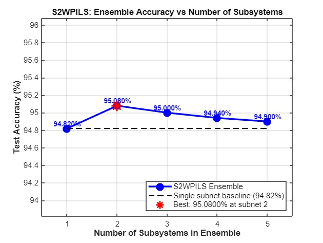
</p>

16×16 binary digit dataset built by Team C5. Used to validate the full pipeline before testing on real benchmarks.

| Property | Value |
|---|---|
| Image size | 16 × 16 (256 features) |
| Classes | 2 — digit 0 and digit 1 |
| Total samples | 1,000 (500 per class) |
| Noise applied | Pixel flips, Gaussian blur, spatial shifts |

### MNIST

28×28 handwritten digits 0–9. 60,000 training / 10,000 test images.

### Fashion-MNIST (F-MNIST)

28×28 clothing images across 10 categories. Harder than MNIST due to within-class variation and between-class similarity.

### NORB

96×96 stereo grayscale images of 5 object categories. 48,600 samples. Most challenging due to 3D perspective variation and high resolution.

---

## 15. Results — Synthetic 0/1 Dataset

### Accuracy Comparison

| Method | Accuracy |
|---|---|
| **SSTPLS (Ours)** | **100.00%** 🥇 |
| PILLS | 100.00% |
| ELM-AE | 100.00% |
| HELM | 100.00% |
| PILAE | 100.00% |
| BLS | 99.50% |

### FISTA vs ADMM — Convergence

<p align="center">
  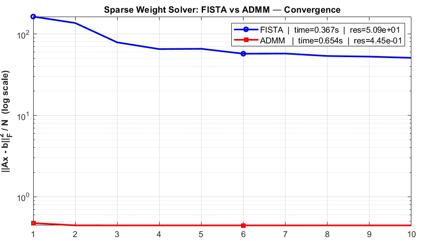
</p>

### FISTA vs ADMM — Metric Comparison

<p align="center">
  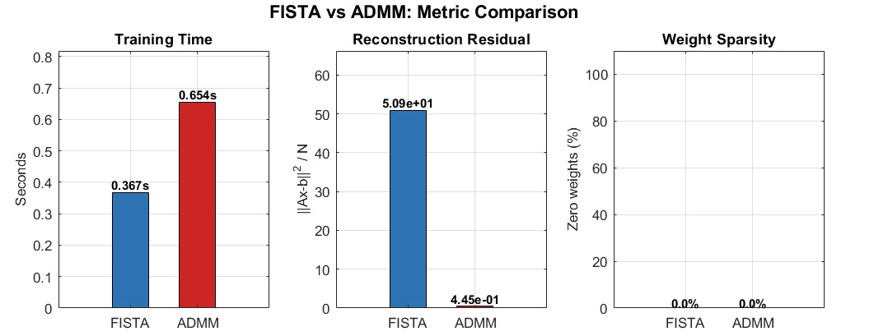
</p>

| Metric | FISTA | ADMM |
|---|---|---|
| Training Time | **0.367 s** ✅ | 0.654 s |
| Reconstruction Residual | $5.09 \times 10^{1}$ | $4.45 \times 10^{-1}$ ✅ |
| Weight Sparsity | 0.0% | 0.0% |

---

## 16. Results — MNIST Dataset

### Accuracy Comparison

| Method | Accuracy |
|---|---|
| **SSTPLS (Ours)** | **98.97%** 🥇 |
| PILLS | 98.84% |
| LeNet-5 | 98.77% |
| ResNet50 | 98.50% |
| VGG16 | 98.30% |
| ELM-AE | 98.12% |
| HELM | 97.83% |
| PILAE | 97.42% |
| BLS | 97.20% |

Our method beats ResNet50 and LeNet-5 while training in **seconds** instead of hours.

### Ensemble Accuracy vs Number of Subsystems

<p align="center">
  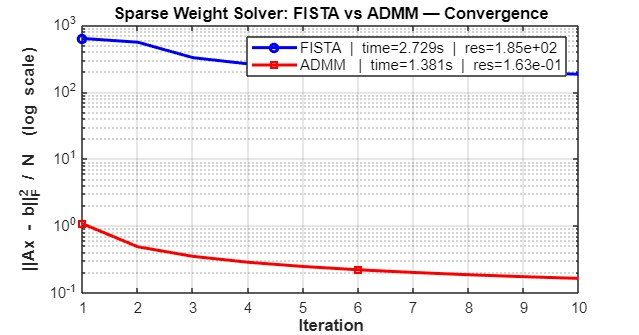
</p>

| Subsystems | Accuracy |
|---|---|
| 1 | 94.82% |
| 2 | **95.08%** ⭐ Best |
| 3 | 95.00% |
| 4 | 94.94% |
| 5 | 94.90% |

### FISTA vs ADMM — Convergence

<p align="center">
  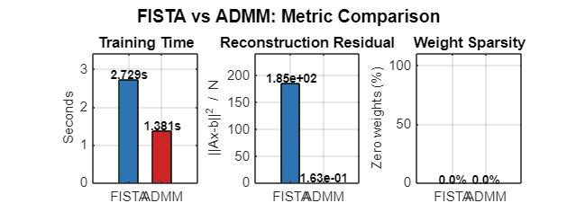
</p>

### FISTA vs ADMM — Metric Comparison

<p align="center">
  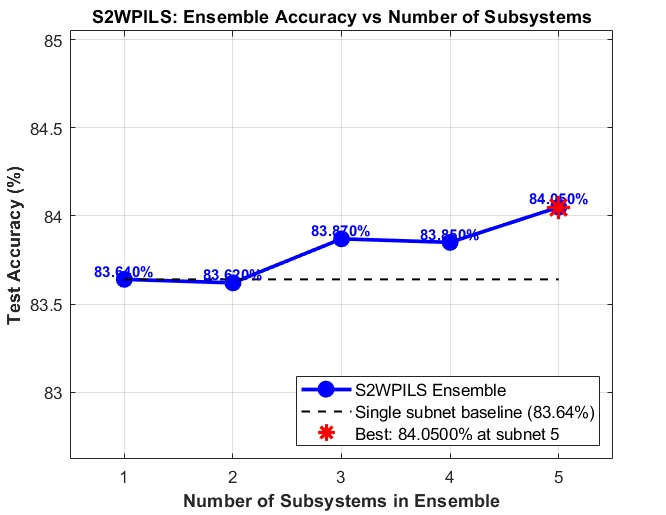
</p>

| Metric | FISTA | ADMM |
|---|---|---|
| Training Time | 2.729 s | **1.381 s** ✅ |
| Reconstruction Residual | $1.85 \times 10^{2}$ | $1.63 \times 10^{-1}$ ✅ |
| Weight Sparsity | 0.0% | 0.0% |

---

## 17. Results — F-MNIST Dataset

### Accuracy Comparison

| Method | Accuracy |
|---|---|
| BLS | **89.60%** 🥇 |
| **SSTPLS (Ours)** | **89.58%** 🥈 |
| PILLS | 89.11% |
| ELM-AE | 88.43% |
| HELM | 87.95% |
| PILAE | 87.20% |

Within 0.02% of first place — essentially tied with BLS.

### Ensemble Accuracy vs Number of Subsystems

<p align="center">
  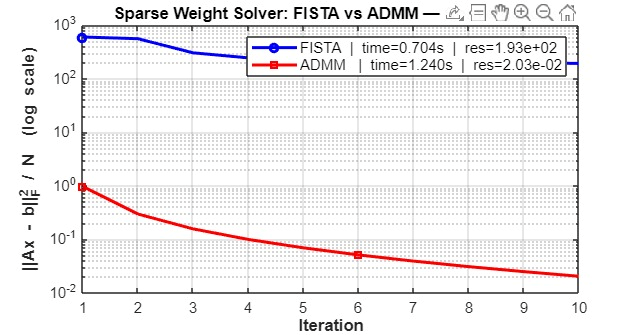
</p>

| Subsystems | Accuracy |
|---|---|
| 1 | 83.64% |
| 2 | 83.62% |
| 3 | 83.87% |
| 4 | 83.85% |
| 5 | **84.05%** ⭐ Best |

### FISTA vs ADMM — Convergence

<p align="center">
  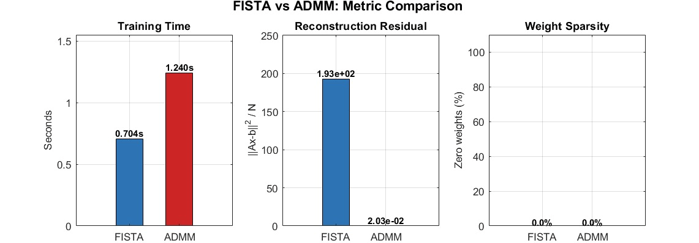
</p>

### FISTA vs ADMM — Metric Comparison

<p align="center">
  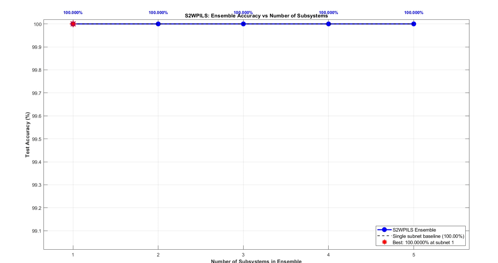
</p>

| Metric | FISTA | ADMM |
|---|---|---|
| Training Time | **0.704 s** ✅ | 1.240 s |
| Reconstruction Residual | $1.93 \times 10^{2}$ | $2.03 \times 10^{-2}$ ✅ |
| Weight Sparsity | 0.0% | 0.0% |

---

## 18. Results — NORB Dataset

### Accuracy Comparison

| Method | Accuracy |
|---|---|
| **SSTPLS (Ours)** | **91.50%** 🥇 |
| PILLS | 90.46% |
| ELM-AE | 89.14% |
| HELM | 88.70% |
| PILAE | 88.11% |
| BLS | 86.79% |

Over 1% ahead of the next best (PILLS) and nearly 5% ahead of BLS — on the hardest dataset.

---

## 19. FISTA vs ADMM Comparison

### Full Summary

| Dataset | FISTA Time | ADMM Time | FISTA Residual | ADMM Residual | Faster |
|---|---|---|---|---|---|
| Synthetic 0/1 | **0.367 s** | 0.654 s | $5.09 \times 10^{1}$ | $4.45 \times 10^{-1}$ | **FISTA** |
| MNIST | 2.729 s | **1.381 s** | $1.85 \times 10^{2}$ | $1.63 \times 10^{-1}$ | **ADMM** |
| F-MNIST | **0.704 s** | 1.240 s | $1.93 \times 10^{2}$ | $2.03 \times 10^{-2}$ | **FISTA** |

**ADMM always achieves lower residual** — its exact constraint enforcement drives $W_d$ and $Z$ to full agreement.

**Speed is dataset-dependent** — FISTA wins on sparse/small data; ADMM wins on dense/large data.

**Higher residual ≠ lower accuracy** — FISTA's residual is ~1000× higher than ADMM's, yet achieves equal or better classification. Reconstruction quality and classification quality are separate objectives.

---

## 20. Conclusion and Contributions

### Final Accuracy

| Dataset | Accuracy | 
|---|---|
| MNIST | 98.97% | 
| NORB | 91.50% | 
| F-MNIST | 89.58% | 
| Synthetic 0/1 | 100.00% | 

SSTPLS trains in **seconds to minutes** versus **hours** for ResNet50, VGG16, and LeNet-5 — at equal or better accuracy.

### Team C5 Contributions

| Contribution | Description |
|---|---|
| **GPU Acceleration** | Added `gpuArray` support with CPU–GPU fixes for `mapminmax`, `orth`, and related MATLAB functions — enables NORB 96×96 training in practical time |
| **Synthetic 0/1 Dataset** | Custom 16×16 binary digit dataset with pixel-flip, blur, and spatial-shift noise for end-to-end pipeline validation |
| **Visualisation** | Ensemble accuracy vs subsystems plots and FISTA vs ADMM convergence comparison plots across all four datasets |

---

## 21. Glossary

| Term | Meaning |
|---|---|
| **SSTPLS** | Semi-adaptive Synergetic Two-way Pseudoinverse Learning System |
| **PILAE** | Pseudoinverse Learning Based Autoencoder |
| **FISTA** | Fast Iterative Shrinkage-Thresholding Algorithm |
| **ADMM** | Alternating Direction Method of Multipliers |
| **ISTA** | Iterative Shrinkage-Thresholding Algorithm (no momentum — slower than FISTA) |
| **LASSO** | Least Absolute Shrinkage and Selection Operator ($\ell_1$ regularisation) |
| **BLS** | Broad Learning System |
| **HELM** | Hierarchical Extreme Learning Machine |
| **ELM-AE** | Extreme Learning Machine — Autoencoder |
| **PILLS** | Pseudoinverse-based Incremental Learning with Layered Structure |
| **Moore-Penrose pseudoinverse** | $A^{\dagger} = A^{\top}(A A^{\top})^{-1}$ for full row-rank $A$ |
| **Frobenius norm** $\|\cdot\|_F$ | $\|A\|_F = \sqrt{\sum_{i,j} a_{ij}^2}$ — total energy of all entries |
| **$\ell_1$ norm** $\|\cdot\|_1$ | $\|A\|_1 = \sum_{i,j} \|a_{ij}\|$ — promotes sparsity |
| **Soft-thresholding** $\mathcal{S}_\tau$ | $\mathrm{sign}(w)\cdot\max(\|w\|-\tau,0)$ — zeroes small weights exactly |
| **Lipschitz constant $L$** | $L = 2\lambda_{\max}(HH^{\top})$ — controls FISTA step size |
| **Dual variable $U$** | Tracks constraint violation $W_d - Z$ in ADMM |
| **$\rho$** | ADMM penalty: how strongly $W_d$ and $Z$ are forced to agree |
| **Early stopping** | Stops adding layers when validation accuracy plateaus |
| **One-hot encoding** | Class $k$ of $C$ → binary vector of length $C$ with 1 at position $k$ |
| **tanh** | $\tanh(x) = (e^x - e^{-x})/(e^x + e^{-x})$ — activation function |
| **atanh** | $\tanh^{-1}(x)$ — used in backward label encoding |
| **$\lambda_{\max}$** | Largest eigenvalue of a matrix |
| **Element-wise addition** | $(A+B)_{ij} = a_{ij}+b_{ij}$ — used to combine ensemble scores |

---

## 22. Citation

**This project implements the method described in the following paper:**

> Binghong Liu, Ziqi Zhao, Shupan Li, and Ke Wang. *Semi-adaptive Synergetic Two-way Pseudoinverse Learning System*. arXiv preprint arXiv:2406.18931v2, 2024.

- **Paper** — [arXiv:2406.18931v2](https://arxiv.org/abs/2406.18931) (PDF)  
- **Official Code & Full Repository** — [GitHub: B-berrypie/Semi-adaptive-Synergetic-Two-way-Pseudoinverse-Learning-System](https://github.com/B-berrypie/Semi-adaptive-Synergetic-Two-way-Pseudoinverse-Learning-System)

**BibTeX:**
```bibtex
@misc{liu2024sstpls,
  title        = {Semi-adaptive Synergetic Two-way Pseudoinverse Learning System},
  author       = {Binghong Liu and Ziqi Zhao and Shupan Li and Ke Wang},
  year         = {2024},
  eprint       = {2406.18931},
  archivePrefix= {arXiv},
  primaryClass = {cs.LG},
  note         = {Code available at https://github.com/B-berrypie/Semi-adaptive-Synergetic-Two-way-Pseudoinverse-Learning-System}
}


